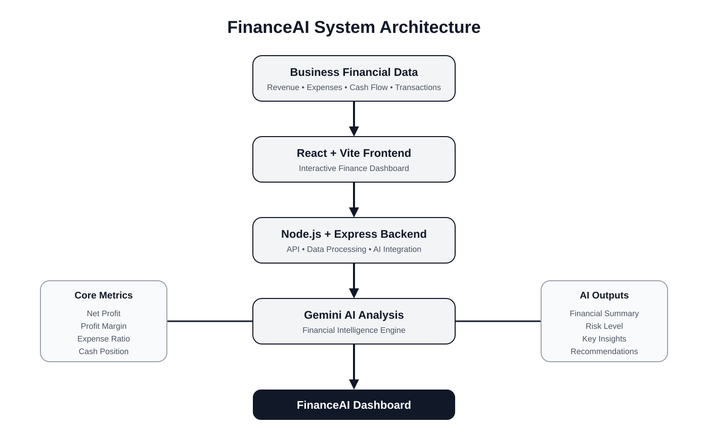

# 💰 FinanceAI – AI Financial Controller

> **AI-powered financial intelligence platform for smarter business decisions.**

FinanceAI is an AI-powered financial controller designed to help businesses understand their financial performance, identify financial risks, and receive intelligent recommendations using **Google Gemini AI**.

---

## 📌 Overview

Managing business finances often requires analyzing revenue, expenses, cash flow, profitability, and financial risks across multiple data sources.

**FinanceAI** brings these capabilities into one intelligent dashboard.

The platform analyzes financial data, calculates important financial metrics, identifies potential risks, and generates AI-powered insights and recommendations.

---

## 🎯 Objectives

* Monitor business financial performance
* Analyze revenue and expenses
* Track profitability and cash flow
* Detect potential financial risks
* Generate AI-powered financial insights
* Provide practical cost-saving recommendations
* Present financial information through an interactive dashboard
* Support better and faster financial decision-making

---

## 🚀 Key Features

### 📊 Financial Dashboard

* Total Revenue
* Total Expenses
* Net Profit
* Cash Balance
* Financial Health Score
* Revenue vs Expense visualization

### 💰 Revenue Analysis

* Revenue tracking
* Revenue performance monitoring
* Income transaction analysis
* Revenue trend visualization

### 💸 Expense Analysis

* Expense tracking
* Expense ratio calculation
* Expense monitoring
* Cost efficiency insights

### 📈 Profit & Loss

* Net profit calculation
* Profit margin analysis
* Business profitability monitoring

### 💵 Cash Flow Monitoring

* Cash balance tracking
* Cash position analysis
* Financial stability monitoring

### ⚠️ Financial Risk Detection

* Risk level identification
* Financial risk analysis
* Risk-aware recommendations

### 🤖 AI Financial Insights

Powered by **Google Gemini AI** to generate:

* Financial summaries
* Key financial insights
* Risk assessment
* Improvement suggestions
* Cost-saving recommendations

### 🧾 Transaction Management

* Add transactions
* Search transactions
* Delete transactions
* Automatically update financial metrics

### 📄 Financial Reports

* Financial analysis reports
* AI-generated summaries
* Downloadable reports

---

## 🏗️ System Architecture



FinanceAI follows a modular architecture connecting the financial data layer, React frontend, Node.js backend, Gemini AI engine, financial intelligence layer, and interactive dashboard.

---

## 🛠️ Tech Stack

| Technology       | Purpose                |
| ---------------- | ---------------------- |
| React            | Frontend UI            |
| Vite             | Frontend development   |
| Node.js          | Backend runtime        |
| Express.js       | Backend API            |
| Google Gemini AI | Financial analysis     |
| Recharts         | Data visualization     |
| Lucide React     | UI icons               |
| LocalStorage     | Local data persistence |
| CSS              | Responsive styling     |

---

## 📂 Project Structure

```text
ai-finance-controller/
│
├── public/
│
├── src/
│   ├── App.jsx
│   ├── App.css
│   ├── main.jsx
│   └── assets/
│
├── server/
│   ├── server.js
│   ├── package.json
│   └── .env
│
├── financeai-architecture.svg
├── package.json
├── package-lock.json
├── .gitignore
└── README.md
```

> **Note:** `server/.env` contains the Gemini API key and is excluded from GitHub using `.gitignore`.

---

## ⚙️ Installation & Setup

### 1. Clone the repository

```bash
git clone https://github.com/saivanisapuru23-max/ai-finance-controller.git
cd ai-finance-controller
```

### 2. Install frontend dependencies

```bash
npm install
```

### 3. Install backend dependencies

```bash
cd server
npm install
```

### 4. Configure Gemini API

Create a `.env` file inside the `server` folder:

```env
GEMINI_API_KEY=your_gemini_api_key
```

### 5. Start the backend

Inside the `server` folder:

```bash
node server.js
```

Backend:

```text
http://localhost:5000
```

### 6. Start the frontend

Open another terminal in the project root:

```bash
npm run dev
```

Frontend:

```text
http://localhost:5173
```

---

## 📊 Financial Metrics

FinanceAI calculates and monitors important financial indicators.

### Net Profit

Net Profit represents the difference between total revenue and total expenses.

### Profit Margin

Profit Margin measures profitability relative to total revenue.

### Expense Ratio

Expense Ratio represents the proportion of revenue used for business expenses.

### Cash Position

Cash Position provides an overview of the available business cash balance.

### Financial Health Score

FinanceAI combines financial indicators to provide an overall financial health assessment.

---

## 🤖 AI Financial Analysis

FinanceAI uses **Google Gemini AI** to analyze financial information and generate intelligent insights.

The AI analysis provides:

* Net profit analysis
* Profit margin analysis
* Expense efficiency analysis
* Cash position assessment
* Financial risk level
* Key financial insights
* Cost-saving recommendations

The AI output is presented directly inside the FinanceAI dashboard.

---

## 🔐 Security

FinanceAI follows basic security practices for protecting application credentials.

* Gemini API key is stored in environment variables
* `.env` files are excluded from Git
* API credentials are not stored in frontend code
* Backend handles Gemini API communication
* Sensitive configuration is separated from source code

---

## 🧠 Responsible AI

FinanceAI is designed as a **financial decision-support system**.

AI-generated insights and recommendations should be reviewed by a qualified human before making important financial decisions.

The system does not replace professional financial, accounting, or legal advice.

---

## 🔮 Future Enhancements

* Real-time banking integration
* Automated financial data import
* Advanced financial forecasting
* Budget planning
* Automated spending alerts
* AI-powered cash-flow forecasting
* Multi-company support
* Role-based access control
* Cloud database integration
* Advanced financial risk scoring
* PDF financial reports
* Email-based financial alerts

---

## 🌟 Project Highlights

* ✅ AI-powered financial analysis
* ✅ Google Gemini integration
* ✅ Interactive financial dashboard
* ✅ Revenue and expense tracking
* ✅ Profitability analysis
* ✅ Cash-flow monitoring
* ✅ Financial risk detection
* ✅ AI-generated recommendations
* ✅ Transaction management
* ✅ Responsive premium UI
* ✅ Visual data analytics
* ✅ Responsible AI approach

---

## 💡 Why FinanceAI?

FinanceAI simplifies financial monitoring by combining traditional financial metrics with AI-powered analysis.

Instead of manually analyzing multiple financial indicators, businesses can use one dashboard to understand:

**Revenue → Expenses → Profit → Cash Flow → Risk → AI Insights → Recommendations**

This enables faster financial understanding and supports smarter business decisions.

---

## 📌 Project

**Project Name:** FinanceAI – AI Financial Controller

**Category:** AI + FinTech

**Powered by:** Google Gemini AI

**Frontend:** React + Vite

**Backend:** Node.js + Express

**Visualization:** Recharts

**Repository:**
https://github.com/saivanisapuru23-max/ai-finance-controller
